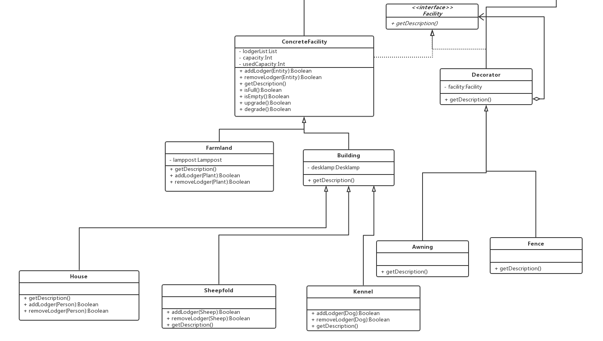

# API 说明文档

## 3.1 Decorator

### 3.3.1 一套实现

#### 3.1.1.1 API描述

Facility是一个定义装饰ConcreteFacility的接口，定义了getDecription()方法，Decorator类的子类，如Awning和Fence，可以装饰ConcreteFacility类及其子类。

#### 3.1.1.2 class diagram

 

## 3.2 Adapter

### 3.2.1 一套实现

#### 3.2.1.1 API描述

Farmland类需要用到的是Lamppost类，但是我们目前只有Desklamp类。我们希望有一个类能自动将Desklamp类转为Lamppost类，这个类中有一个成员变量是Desklamp类型的。使用Desklamp提供的方法实现Lamppost接口，这就是适配器做的事情。

#### 3.2.1.2 class diagram

## 3.3 Chain of Responsibility

### 3.2.1 一套实现

#### 3.2.1.1 API描述

是用Farmland，House，Kennel等等一系列类试图处理一个mortgage(value)请求，这些类之间是一个松散的耦合，唯一共同点是在他们之间传递mortgage请求。也就是说，来了一个请求，A类先处理，如果没有处理，就传递到B类处理，如果没有处理，就传递到C类处理，就这样象一个链条(chain)一样传递下去。

ConcreteFacility类中successor记录了责任链里下一个处理者

#### 3.2.1.2 class diagram

 